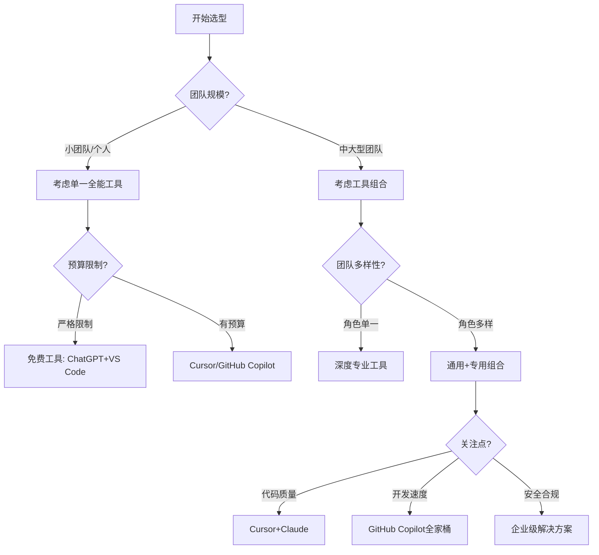

# 工具推荐表

本章提供了当前市场上主流AI辅助开发工具的详细比较和推荐，帮助团队根据自身需求选择最合适的工具组合。

## 主流AI编程工具全景对比

下表对市场上主要的AI编程助手工具进行了综合对比：

| 工具名称 | 定位 | 适用角色 | 优势 | 不足 | 价格模型 |
|---------|------|---------|------|------|---------|
| **Cursor** | AI原生代码编辑器 | 全角色 | 完整IDE体验、多模型支持、代码库理解 | 需要适应新编辑器 | 基础功能免费，高级功能$20/月 |
| **GitHub Copilot** | IDE插件 | 全角色 | VS Code/JetBrains集成、实时补全 | 上下文理解有限、成本较高 | $10-19/月/用户 |
| **V0.dev** | UI原型生成 | 前端开发 | 高质量React组件生成、交互设计 | 仅支持React/Tailwind | 预览版免费，正式版未定价 |
| **Claude** | 通用AI助手 | 全角色，尤其后端/算法 | 强大的推理能力、100K上下文窗口 | 非专用编程工具 | 免费版有限额，Pro版$20/月 |
| **ChatGPT** | 通用AI助手 | 全角色 | 广泛的知识覆盖、免费可用 | 编程特化功能少 | 免费版+Plus版$20/月 |
| **Phind** | 开发问答助手 | 全角色 | 针对编程优化、实时信息 | 代码生成能力较弱 | 基础免费，Pro版$20/月 |
| **Codeium** | IDE插件 | 全角色 | 轻量级、多IDE支持 | 能力弱于顶级模型 | 个人免费，团队版收费 |
| **Tabnine** | 代码补全工具 | 全角色 | 本地模型选项、轻量级 | 仅专注代码补全 | 基础免费，Pro版$12/月 |
| **Bard/Gemini** | 通用AI助手 | 全角色 | 免费使用、谷歌技术栈集成 | 编程特化功能较少 | 基础免费，高级版$20/月 |
| **Amazon Q** | 编程助手 | AWS开发者 | AWS生态集成、企业安全 | 主要面向AWS开发 | 部分免费，完整版收费 |

## 角色专属工具推荐

### 前端工程师工具箱

| 工具 | 主要用途 | 特性评分(1-5) | 推荐指数 |
|-----|---------|--------------|---------|
| **Cursor** | 代码编写与重构 | 代码理解:5, UI集成:3, 文档生成:4 | ⭐⭐⭐⭐⭐ |
| **V0.dev** | UI组件生成 | 组件质量:5, 定制化:4, 集成度:3 | ⭐⭐⭐⭐⭐ |
| **GitHub Copilot** | 实时代码补全 | 补全准确度:4, IDE集成:5, 响应速度:5 | ⭐⭐⭐⭐ |
| **Figma AI** | 设计辅助 | UI设计:5, 代码转换:4, 协作:5 | ⭐⭐⭐⭐ |
| **CSS Autopilot** | 样式生成 | 样式质量:4, 自定义:3, 响应式:5 | ⭐⭐⭐ |

**前端最佳组合**：Cursor + V0.dev + Figma AI

### 后端工程师工具箱

| 工具 | 主要用途 | 特性评分(1-5) | 推荐指数 |
|-----|---------|--------------|---------|
| **Cursor** | 代码编写与架构设计 | 代码理解:5, API设计:4, 性能优化:4 | ⭐⭐⭐⭐⭐ |
| **Claude** | 系统设计与问题排查 | 推理能力:5, 上下文窗口:5, 代码质量:4 | ⭐⭐⭐⭐⭐ |
| **GPT-4** | 复杂算法与模式实现 | 算法能力:5, 模式应用:5, 文档生成:4 | ⭐⭐⭐⭐ |
| **Database Schema AI** | 数据库设计 | 模式设计:5, 索引优化:4, 迁移脚本:4 | ⭐⭐⭐⭐ |
| **Amazon Q** | AWS云开发 | AWS集成:5, 安全实践:4, 最佳实践:4 | ⭐⭐⭐ |

**后端最佳组合**：Cursor + Claude + 特定领域工具

### 测试工程师工具箱

| 工具 | 主要用途 | 特性评分(1-5) | 推荐指数 |
|-----|---------|--------------|---------|
| **ChatGPT** | 测试用例生成 | 覆盖全面性:4, 边界情况:5, 可读性:4 | ⭐⭐⭐⭐⭐ |
| **Cursor** | 测试脚本编写 | 代码理解:5, 框架支持:4, 调试辅助:4 | ⭐⭐⭐⭐⭐ |
| **Test GPT** | 专业测试助手 | 测试设计:5, 自动化脚本:5, 缺陷预测:4 | ⭐⭐⭐⭐ |
| **Selenium AI** | UI测试辅助 | 元素识别:4, 脚本生成:5, 维护性:3 | ⭐⭐⭐ |
| **Mock Data Generator** | 测试数据生成 | 数据多样性:5, 真实性:4, 定制化:5 | ⭐⭐⭐⭐ |

**测试最佳组合**：ChatGPT + Cursor + Mock Data Generator

### 算法工程师工具箱

| 工具 | 主要用途 | 特性评分(1-5) | 推荐指数 |
|-----|---------|--------------|---------|
| **Claude 3.5 Sonnet** | 算法设计与优化 | 数学推理:5, 复杂度分析:5, 代码实现:4 | ⭐⭐⭐⭐⭐ |
| **Cursor** | 代码实现与调试 | 代码理解:5, 算法转换:4, 性能优化:4 | ⭐⭐⭐⭐⭐ |
| **Phind** | 研究与问题解决 | 最新信息:5, 解题思路:5, 参考资料:5 | ⭐⭐⭐⭐⭐ |
| **Jupyter AI** | 交互式数据分析 | 代码辅助:5, 可视化:4, 探索性分析:5 | ⭐⭐⭐⭐ |
| **Kaggle Code Assistant** | 比赛辅助 | 模型选择:5, 特征工程:4, 超参调优:5 | ⭐⭐⭐⭐ |

**算法最佳组合**：Claude + Jupyter AI + Phind

### 产品经理工具箱

| 工具 | 主要用途 | 特性评分(1-5) | 推荐指数 |
|-----|---------|--------------|---------|
| **ChatGPT** | PRD生成与分析 | 需求整理:4, 用例生成:5, 格式化输出:4 | ⭐⭐⭐⭐⭐ |
| **Notion AI** | 文档创建与整理 | 写作辅助:5, 整理归纳:5, 多语言:4 | ⭐⭐⭐⭐⭐ |
| **飞书多维表格AI** | 数据分析与决策 | 数据整理:5, 自动化:4, 可视化:4 | ⭐⭐⭐⭐ |
| **Miro AI** | 流程图与脑图 | 图表生成:5, 协作性:5, 直观性:4 | ⭐⭐⭐⭐ |
| **UserTesting AI** | 用户研究辅助 | 问题设计:5, 结果分析:4, 洞察生成:5 | ⭐⭐⭐⭐ |

**产品最佳组合**：ChatGPT + Notion AI + Miro AI

## 工具选择决策树

在选择适合团队的AI工具时，可以参考以下决策流程：



## 不同预算下的工具组合推荐

### 低预算方案 ($0-50/月/团队)

* **核心工具**：
  - ChatGPT免费版 + VS Code
  - Codeium免费版

* **工作流**：
  - 使用ChatGPT生成代码框架
  - 在VS Code中实现细节
  - 用Codeium辅助代码补全

* **优势**：几乎零成本入门AI辅助开发
* **局限**：功能有限，需要更多手动操作

### 中等预算方案 ($50-200/月/团队)

* **核心工具**：
  - Cursor专业版 ($20/月) × 核心开发者数量
  - Claude Free + ChatGPT Plus ($20/月) × 1-2人

* **工作流**：
  - 以Cursor为主要开发环境
  - 使用Claude/ChatGPT解决复杂问题

* **优势**：平衡了成本和功能，覆盖大多数开发场景
* **局限**：专业工具使用有限制

### 高预算方案 ($200+/月/团队)

* **核心工具**：
  - GitHub Copilot ($10-19/用户/月) × 全团队
  - Claude Team ($30/用户/月) × 核心开发者
  - V0.dev、Figma AI等专业工具订阅

* **工作流**：
  - 全面集成AI工具到开发流程
  - 角色专属工具全覆盖
  - 定制化AI工作流

* **优势**：全方位AI辅助，最大化生产力提升
* **局限**：需要系统化培训和管理

## 企业级部署考量

大中型企业在选择AI工具时，除了功能外，还需考虑以下因素：

### 安全与合规

| 考量点 | 解决方案 | 推荐工具 |
|-------|---------|---------|
| 代码隐私 | 本地模型部署 | MCP、Ollama、LocalAI |
| 敏感信息保护 | 数据过滤与脱敏 | GitHub Copilot企业版 |
| 审计与追踪 | 使用记录与审计 | 企业版工具 + 自建监控 |
| 合规认证 | 选择有相关认证的服务 | Amazon CodeWhisperer (SOC2) |

### 团队集成与管理

| 需求 | 解决方案 | 工具特性 |
|-----|---------|---------|
| 统一管理 | 企业管理平台 | SSO集成、团队权限 |
| 使用监控 | 使用数据分析 | 使用量、效率提升追踪 |
| 成本控制 | 额度分配与限制 | API使用配额管理 |
| 知识沉淀 | 提示词库与最佳实践 | 共享提示词管理系统 |

## 本地模型部署选项

对于对数据隐私有严格要求的团队，本地模型部署是一个可行方案：

| 工具 | 硬件要求 | 性能对比 | 适用场景 | 部署复杂度 |
|-----|---------|---------|---------|----------|
| **MCP Server** | 中等(16GB RAM+) | 中等 | 团队共享服务 | 中等 |
| **Ollama** | 低至中(8GB RAM+) | 中等 | 个人使用 | 低 |
| **LocalAI** | 可变(取决于模型) | 可变 | 灵活部署 | 中等 |
| **自建LLM服务** | 高(GPU推荐) | 可定制 | 企业级需求 | 高 |

### MCP Server快速部署指南

MCP (Model Control Panel) Server是一个轻量级的本地AI模型服务，可以为Cursor等工具提供API接口：

```bash
# 基本安装步骤
git clone https://github.com/mcpserver/mcp.git
cd mcp
docker-compose up -d

# 配置Cursor使用本地MCP
# 在Cursor设置中添加自定义API端点: http://localhost:8000/v1
```

## 工具选择经验法则

1. **从通用工具开始**：先采用Cursor或ChatGPT等通用工具，了解基本工作流
2. **按角色细分**：根据团队中不同角色的需求，逐步引入专业工具
3. **注重集成性**：选择能与现有工作流和工具链良好集成的解决方案
4. **培训与反馈**：为团队提供充分的培训，并建立反馈机制持续优化
5. **平衡成本与效益**：定期评估工具投资回报，调整订阅组合

## 未来趋势与持续评估

AI辅助开发工具领域发展迅猛，建议团队：

1. **定期评估**：每季度回顾工具使用情况和新兴工具
2. **建立评估框架**：设定清晰的评估指标（效率提升、代码质量等）
3. **试点计划**：为新工具设立小规模试点，收集实际使用数据
4. **社区参与**：关注开发者社区对工具的评价和使用技巧

---

工具选择是AI辅助开发的重要基础，但最终的效果取决于如何将工具融入开发流程，以及团队成员的学习与适应能力。选择合适的工具只是第一步，持续优化使用方法和工作流程才是实现效率提升的关键。 